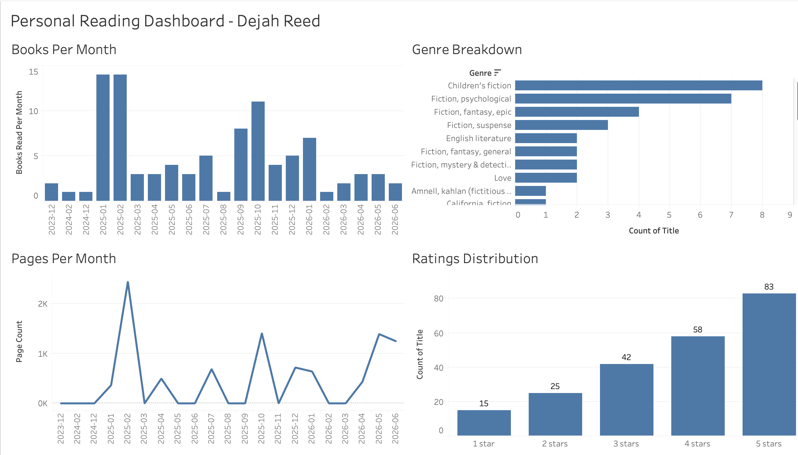

# Personal Reading Tracker
# A Python + Tableau analytics project by Dejah Reed

A personal data analytics pipeline that transforms a raw reading app export into a fully interactive Tableau dashboard while tracking reading volume, page counts, genre preferences, and ratings across 233 books.

---



*(Add a screenshot of your dashboard to the `dashboard/` folder and it will appear here)*

---

# Project Overview

This project was built entirely from personal data, my reading history exported from the **Fable** reading app. The pipeline covers three stages:

1. **Data Cleaning**: Raw export contained Excel-style ISBN wrappers, missing dates, and internal app IDs instead of real ISBNs. Python parsed and cleaned all 322 rows, filtering to 233 confirmed "read" books.
2. **API Enrichment**: Called the free **Open Library API** to retrieve genre tags and page counts for each book, using ISBN lookups with a title/author search fallback for books without valid ISBNs.
3. **Tableau Visualization**: Built a four-sheet interactive dashboard covering reading volume over time, pages read per month, genre distribution, and personal ratings.

---

## Tech Stack

| Tool | Purpose |

| Python 3 | Data cleaning, transformation, API calls |
| Jupyter Notebook | Interactive development environment |
| pandas | Data manipulation and export |
| requests | Open Library API integration |
| Tableau Desktop | Dashboard visualization |
| Open Library API | Genre and page count enrichment (free, no key required) |

---

## Key Findings

- **233 books read** with confirmed data, spanning December 2023 – June 2026
- **Peak reading months:** January and February 2025 at 14 books each (~a book every two days)
- **~30,000 pages read** across the 75 books with page count data
- **36% five-star ratings** — 83 of 233 books rated as favorites
- Top genres (from Open Library tagging): Children's fiction, Psychological fiction, Epic fantasy

---

## Repository Structure

```
personal-reading-tracker/
│
├── README.md                     ← You are here
├── reading_tracker.ipynb         ← Full pipeline notebook (clean → enrich → export)
│
├── data/
│   └── books_tableau.xlsx        ← Cleaned, enriched dataset (Tableau-ready)
│
└── dashboard/
    └── preview.png               ← Dashboard screenshot
```

---

## How to Run This Yourself

### Prerequisites
```bash
pip install requests pandas openpyxl jupyter
```

### Steps

1. **Export your Fable library** using the [ShelfBridge](https://shelfbridge.app) Chrome extension — it produces a Goodreads-style CSV
2. **Clone this repo** and place your `goodreads_import.csv` in the root folder
3. **Open the notebook:**
   ```bash
   jupyter notebook reading_tracker.ipynb
   ```
4. **Run all cells top to bottom** — Step 2 (Open Library enrichment) requires internet access and takes a few minutes (~0.5s delay per book to respect API rate limits)
5. **Import `books_tableau.xlsx`** into Tableau Desktop via Connect → Microsoft Excel

---

## Data Quality Notes

Real-world data is messy and here's what I found and how I handled it:

- **97 of 233 books** had a confirmed read date and only these appear in the monthly timeline charts; all 233 are included in genre and rating analysis
- **34 books** had internal Fable IDs instead of real ISBNs and these used a title/author search fallback against Open Library
- **Open Library genre coverage** was ~25% (58 of 233 books) and the genre chart reflects tagged books only, which skews toward more mainstream titles
- **Page count coverage** was ~32% (75 of 233 books) and months with zero pages visible in the chart reflect books missing from Open Library, not months where I didn't read

---

## What This Project Demonstrates

- End-to-end data pipeline ownership, from raw export to published dashboard
- Real-world data cleaning (inconsistent ISBNs, missing fields, mixed types)
- REST API integration with fallback logic and rate-limit handling
- Data enrichment and feature engineering (reading velocity, month labels, rating categories)
- Tableau dashboard design across multiple chart types

---

## Contact

**Dejah Reed**
[LinkedIn](#www.linkedin.com/in/dejahreed)

